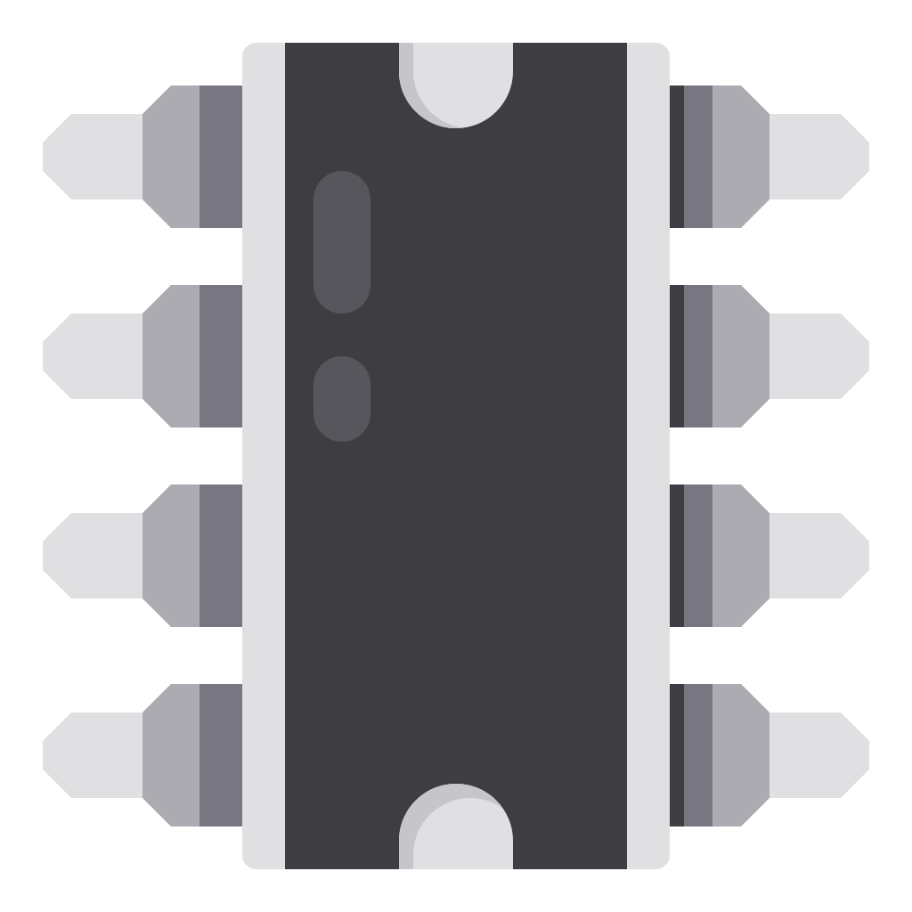

<a href="#">
    
</a>

# SigLAB

[](https://travis-ci.org/alex-spataru/SigLAB)

SigLAB is a multi-platform, multi-purpose serial data visualization program. The goal of this project is to allow embedded developers & makers to easily visualize, present & analyze the data generated by their projects and devices, without the need of writing specialized computer software for each project.

The need for this project arose during the development of the Ground Station Software for several CanSat-based competitions in which I participate. It's simply not sustainable to develop and maintain different GSS programs for each competition & project. The smart solution is to have one common Ground Station software and let each CanSat define how the data is presented to the end user by using an extensible communication protocol.

Furthermore, this approach can be extended to almost any type of project that involves some kind of data acquisition & measurement.


## Communication Protocol

The communication protocol is implemented through a JSON document. For example, my CanSat team uses the following template:

```json
{
    "t":"CanSat 2020",							/* Project title */
    "g":[										/* Project data group array */
        {
            "t":"Mission Status",				/* Group title */
            "d":[								/* Group dataset array */
                {
                    "t":"Mission Time",			/* Dataset title */
                    "v":"%s"						/* Dataset value */
                },
                {
                    "t":"Packet Count",			/* Dataset title */
                    "v":"%s"						/* Dataset value */
                },
                {
                    "t":"Software State",		/* Dataset title */
                    "v":"%s"						/* Dataset value */
                },
                {
                    "t":"Battery Voltage",		/* Dataset title */
                    "v":"%s",					/* Dataset value */
                    "g":true,					/* Graph dataset */
                    "u":"mV"						/* Dataset units */
                }
            ]
        },
        {
            "t":"Sensor Readings",				/* Group title */
            "d":[								/* Group dataset array */
                {	
                    "t":"Altitude",				/* Dataset title */
                    "v":"%s",					/* Dataset value */
                    "u":"m"						/* Dataset units */
                },
                {
                    "t":"Pressure",				/* ... */
                    "v":"%s",					/* ... */
                    "g":true,					/* ... */
                    "u":"KPa"					/* ... */
                },
                {
                    "t":"Temperature",			/* ... */
                    "v":"%s",
                    "g":true,
                    "u":"ºC"
                },
                {
                    "t":"Airspeed",				/* ... */
                    "v":"%s",
                    "u":"m/s"
                },
                {
                    "t":"Particle Count",		/* ... */
                    "v":"%s"
                }
            ]
        },
        {
            "t":"GPS",							/* ... */
            "d":[
                {
                    "t":"UTC Time",
                    "v":"%s"
                },
                {
                    "t":"Longitude",
                    "v":"%s"
                },
                {
                    "t":"Latitude",
                    "v":"%s"
                },
                {
                    "t":"Altitude",
                    "v":"%s"
                },
                {
                    "t":"Num. Sats",
                    "v":"%s"
                }
            ]
        }
    ]
}
```
    
The `%s` values are replaced with real-time data from each sensor and subsystem. As you can see, the data frame contains the following information:

- Project title
- Groups
  - Group title
  - Group data
    - Dataset title
    - Dataset value
    - Dataset unit
    - Dataset graph (or not)
    
This information is processed by SigLAB, which builds the user interface according to the information contained in each frame. This information is also used to generate a CSV file with all the readings received from the serial device, the CSV file can be used for analysis and data-processing within MATLAB.

## Build instructions

##### Requirements

The only requirement to compile the application is to have [Qt](http://www.qt.io/download-open-source/) installed in your system. The desktop application will compile with Qt 5.15 or greater.

### Cloning this repository

This repository makes use of [`git submodule`](https://git-scm.com/docs/git-submodule). In order to clone it, you have two options:

One-liner:

    git clone --recursive https://github.com/alex-spataru/SigLAB

Normal procedure:

    git clone https://github.com/alex-spataru/SigLAB
    cd SigLAB
    git submodule init
    git submodule update
    
###### Compiling the application

Once you have Qt installed, open *SigLAB.pro* in Qt Creator and click the "Run" button.

Alternatively, you can also use the following commands:

	qmake
	make -j4

## Licence

This project is released under the MIT license, for more information, check the [LICENSE](LICENSE.md) file.


