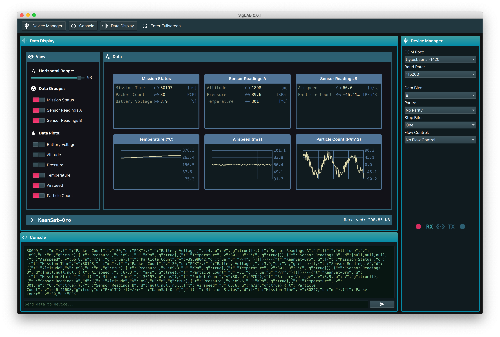

# SigLAB

SigLAB is a multi-platform, multi-purpose serial data visualization program. The goal of this project is to allow embedded developers & makers to easily visualize, present & analize the data generated by their projects and devices, without the need of writing specialized computer software for each project.

The need for this project arose during the development of the Ground Station Software for several CanSat-based competitions in which I participate. It's simply not sustainable to develop and maintain different GSS programs for each competition & project. The smart solution is to have one common Ground Station software and let each CanSat define how the data is presented to the end user using an extensible communication protocol. Furthermore, this approach can be extended to almost any type of project that involves some kind of data acquisition & measurement.



## Communication Protocol

The communication protocol is implemented through a JSON document. For example, my CanSat team uses the following template:

```json
{
    "title":"KAANSATQRO",
    "groups":[
        {
            "title":"Mission Status",
            "data":[
                {
                    "title":"Mission Time",
                    "value":"%s"
                },
                {
                    "title":"Packet Count",
                    "value":"%s"
                },
                {
                    "title":"Software State",
                    "value":"%s"
                },
                {
                    "title":"Battery Voltage",
                    "value":"%s",
                    "graph":true,
                    "units":"mV"
                }
            ]
        },
        {
            "title":"Sensor Readings",
            "data":[
                {
                    "title":"Altitude",
                    "value":"%s",
                    "units":"m"
                },
                {
                    "title":"Pressure",
                    "value":"%s",
                    "graph":true,
                    "units":"KPa"
                },
                {
                    "title":"Temperature",
                    "value":"%s",
                    "graph":true,
                    "units":"ºC"
                },
                {
                    "title":"Airspeed",
                    "value":"%s",
                    "units":"m/s"
                },
                {
                    "title":"Particle Count",
                    "value":"%s"
                },
                {
                    "title":"Magnitude North",
                    "value":"%s"
                }
            ]
        },
        {
            "title":"GPS",
            "data":[
                {
                    "title":"UTC Time",
                    "value":"%s"
                },
                {
                    "title":"Longitude",
                    "value":"%s"
                },
                {
                    "title":"Latitude",
                    "value":"%s"
                },
                {
                    "title":"Altitude",
                    "value":"%s"
                },
                {
                    "title":"Num. Sats",
                    "value":"%s"
                }
            ]
        }
    ]
}
```
    
The `%s` values are replaced with real-time data from each sensor and subsystem. As you can see, the data frame contains the following information:

- Project title
- Groups
  - Group title
  - Group data
    - Dataset title
    - Dataset value
    - Dataset unit
    - Dataset graph (or not)
    
This information is processed by SigLAB, which builds the user interface according to the information contained in each frame. This information is also used to generate a CSV file with all the readings received from the serial device, the CSV file can be used for analysis and data-processing within MATLAB.

## Licence

This project is released under the MIT license, for more information, check the [LICENSE](LICENSE.md) file.


